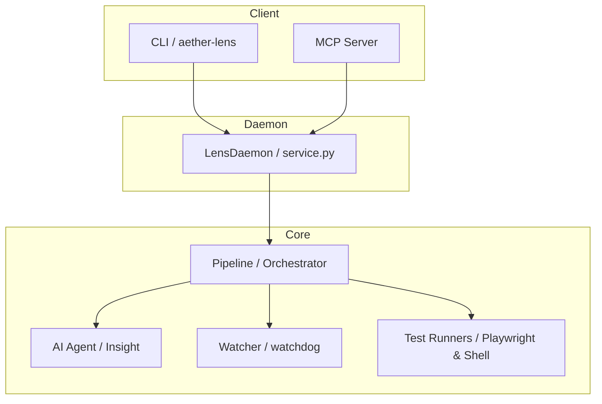

# Aether Lens (Vibe Test Insight)

[](https://github.com/aether-platform/aether-lens/releases/tag/nightly)

> **"Code changes shouldn't just run tests; they should reveal insights."**

Aether Lens は、Aether Platform における **Vibe Test Insight (VTI) / [Nightly Build](https://github.com/aether-platform/aether-lens/releases/tag/nightly)** を実現するためのコアツールです。
AI エージェントが開発者の意図（Vibe）を読み取り、変更箇所に最適なテストを自動生成・実行・フィードバックする究極の DevLoop を提供します。

---

## 🚀 Key Features

### 1. Vibe-Aware Analysis

ただの差分解析ではありません。LLM がコードの「意図」を理解し、フロントエンドの表示崩れからバックエンドのロジック整合性まで、多角的な検証ポイントを自動特定します。

### 2. Live DevLoop (Watch Mode)

ファイルの変更をミリ秒単位で検知し、即座に AI 解析とテスト実行のサイクルを回します。開発者は保存ボタンを押すだけで、即座に「Vibe Check」の結果を受け取れます。

### 3. Strategy Switching

プロジェクトのフェーズや性質に合わせて解析エンジンを最適化。

- `auto`: 自動検知
- `frontend`: 表示・UI重視 (Playwright 連携)
- `backend`: ロジック・API重視 (Command 実行)
- `microservice`: 複数サービス間の依存解析
- `custom`: 独自のプロンプト指示による特化解析

### 4. Hybrid Test Execution

- **Visual Tests**: Playwright を使用したブラウザレンダリングのスナップショット検証。
- **Command Tests**: `pytest`, `npm test`, `go test` など、プロジェクト既存のテストスイートを AI が判断して実行。

### 5. MCP Integration

Model Context Protocol をサポート。Cursor や Claude Desktop などの外部 AI から、Aether Lens の解析機能を「ツール」として透過的に呼び出すことが可能です。

---

## 🏗 Architecture

Aether Lens は、拡張性と保守性を重視した 3 層構造を採用しています。



- **Client Layer**: CLI (`argparse`) や MCP (`fastmcp`) を通じたユーザーインターフェース。
- **Daemon Layer**: ファイル監視、再実行のライフサイクル、依存関係 (`dependency-injector`) を管理。
- **Core Layer**: Git 差分取得、AI 解析、ブラウザ制御、コマンド実行の具体的な実装。

---

## 🛠 Usage

### Installation

`uv` を使用して、開発モードでインストールすることを推奨します。

```bash
uv pip install -e . --system
```

### 1. 初期設定 (Initialize)

対話形式でプロジェクトの設定ファイルを生成します。

```bash
aether-lens-cli init
```

### 2. 手動解析 (Run)

現在のコード状態に対して、1 回限りの解析を実行します。

```bash
aether-lens-cli . --strategy frontend
```

### 3. 開発ループ (Watch Mode)

変更を監視し、自動的に VTI を回します。

```bash
aether-lens-cli . --watch
```

### 4. MCP サーバー起動

外部 AI エージェントとの連携用サーバーを起動します。

```bash
aether-lens-cli --mcp
```

---

## ⚙️ Configuration

`aether-lens.config.json` でプロジェクトごとの振る舞いを固定できます。

```json
{
  "strategy": "custom",
  "custom_instruction": "すべての関数に対するドキュメントの欠落をチェックしてください。",
  "dev_loop": {
    "browser_targets": ["desktop", "mobile"],
    "debounce_seconds": 2
  }
}
```

---

## 🛠 Tech Stack

- **CLI**: `rich` (Terminal UI), `argparse`, `click` (for subcommands)
- **AI Integration**: `openai` (Mocked/Custom Connector)
- **Core Ops**: `watchdog` (FileSystem Watcher), `playwright` (Visual Testing)
- **Architecture**: `dependency-injector` (DI), `fastmcp` (MCP Support)
- **Reporting**: `allure-pytest`, `reportportal-client`
